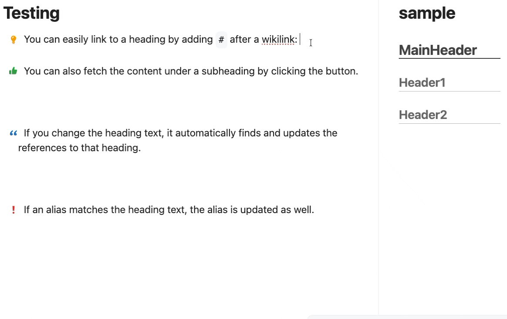

# Heading Autolink

[ [English](https://github.com/jaewonE/heading-autolink) | [한국어](https://github.com/jaewonE/heading-autolink/blob/master/README.ko.md) ]



Heading Autolink는 Markdown heading wikilink를 관리하는 Obsidian 플러그인입니다. Heading picker로 heading link를 삽입하고, 누락된 heading alias를 추가하고, heading 이름 변경 후 heading link를 갱신하고, 선택한 heading section의 내용을 삽입할 수 있습니다.

## 주요 기능

- `[[note]]#`, `[[note|alias]]#`, `[[note#Heading|Heading]]#`처럼 file wikilink 또는 기존 heading wikilink 뒤에 `#`를 입력하면 heading picker를 엽니다.
- `[[note#Heading|Heading]]` 형식의 heading link를 삽입합니다.
- 선택한 heading과 하위 heading을 picker에서 함께 삽입합니다.
- Picker 검색 텍스트를 macOS `Command+Enter`, Windows/Linux `Ctrl+Enter`, 또는 일치하는 heading 결과가 없을 때 `Enter`로 빠르게 file alias로 삽입합니다.
- plain text, ordered list, unordered list, `- {icon}` list 형식을 가능한 유지합니다.
- 줄을 벗어났을 때 alias 없는 heading wikilink에 alias를 추가합니다.
- 단일 heading rename이 감지되면 vault 전체의 일치하는 heading wikilink를 갱신합니다.
- alias가 기존 heading text와 정확히 같지 않은 custom alias는 보존합니다.
- 기본적으로 fenced code block, inline code, YAML frontmatter, HTML comment 내부 링크는 무시합니다.

## 지원 Wikilink

지원 예시:

```markdown
[[a#title1]]
[[a#title1|title1]]
[[folder/a#title1]]
[[a.md#title1]]
[[a#heading1#heading2]]
[[a#heading1#heading2|heading2]]
[[a|alias]]#
[[a#title1|title1]]#
```

비지원 예시:

```markdown
![[a#title1]]
[[#local heading]]
[[a#^block]]
[title](a.md#title1)
```

## 사용 방법

### Heading link 삽입

file wikilink 바로 뒤에 `#`를 입력합니다.

```markdown
[[note]]#
```

이미 alias가 있는 wikilink 뒤에도 `#`를 입력할 수 있습니다.

```markdown
[[note|alias]]#
```

이미 heading을 가리키는 wikilink 뒤에서도 같은 picker가 열립니다.

```markdown
[[note#Old heading|Old heading]]#
```

대상 note가 Markdown 파일로 resolve되면 picker가 커서 아래에 열립니다. `Enter`를 누르거나 heading을 클릭하면 단일 heading link가 삽입됩니다. Recursive insert 버튼을 사용하면 선택한 heading과 하위 heading을 함께 삽입합니다. 트리거 link에 이미 alias가 있으면 선택한 heading link가 기존 alias를 대체합니다. 대상 note에 heading이 없으면 heading list가 비어 있는 picker가 열리며, fast file alias를 입력할 수 있습니다.

Picker 검색어가 있는 상태에서 macOS는 `Command+Enter`, Windows/Linux는 `Ctrl+Enter`를 누르면 heading 결과가 보여도 검색어를 file alias로 삽입합니다.

```markdown
[[note|search text]]
```

검색어와 일치하는 heading 결과가 없으면 `Enter`도 검색어를 file alias로 삽입합니다.

### Alias 추가

Auto alias가 활성화되어 있으면 alias 없는 heading link를 작성한 뒤 다른 줄로 이동할 때 다음과 같이 변경될 수 있습니다.

```markdown
[[a#title1]]
```

변경 후:

```markdown
[[a#title1|title1]]
```

계층형 heading link는 마지막 heading segment를 alias로 사용합니다.

### Heading rename 후 link 갱신

Heading rename update가 활성화되어 있으면 `a.md`의 `title1` heading을 `newTitle1`로 변경했을 때 vault 내부 Markdown 파일의 일치하는 링크를 갱신할 수 있습니다.

```markdown
[[a#title1]]
[[a#title1|title1]]
```

변경 후:

```markdown
[[a#newTitle1]]
[[a#newTitle1|newTitle1]]
```

플러그인은 heading 하나만 변경되었고 heading 개수와 level이 그대로인 경우에만 rename으로 처리합니다. 기존 heading text가 중복되어 있었다면 `[[a#title1]]` 같은 simple link는 대상이 모호하므로 갱신하지 않습니다.

## 파일 접근 및 수정 범위

Heading Autolink는 link resolve, heading 탐색, heading snapshot 생성을 위해 현재 vault의 Markdown 파일을 읽습니다. Vault 외부 파일은 읽지 않습니다.

플러그인은 다음 경우에 현재 vault의 Markdown 파일을 수정할 수 있습니다.

- Auto alias가 활성화되어 있고 alias 없는 heading wikilink가 있는 줄을 벗어날 때 active editor line을 수정합니다.
- Heading rename update가 활성화되어 있고 단일 heading rename이 감지되면 vault 전체 Markdown 파일을 수정합니다.
- Picker에서 heading, recursive insertion 또는 fast file alias를 선택하면 active editor line을 수정합니다.

플러그인은 Markdown이 아닌 파일을 수정하지 않습니다.

## 설정

- **Enable heading rename updates**: 단일 heading rename 후 vault 전체의 일치하는 heading wikilink를 갱신합니다. 기본값은 꺼짐입니다.
- **Enable title picker**: file wikilink 또는 기존 heading wikilink 뒤에 `#`를 입력했을 때 heading picker를 엽니다.
- **Enable auto alias**: 줄을 벗어났을 때 heading wikilink에 빠진 표시 텍스트를 추가합니다. 기본값은 꺼짐입니다.
- **Picker size**: `small`, `medium`, `large` 중 picker 크기를 선택합니다.
- **Picker max visible items**: 스크롤이 생기기 전까지 보이는 picker 결과 수를 설정합니다.
- **Ignore links in code blocks**: fenced code block, inline code, YAML frontmatter, HTML comment 내부 링크를 건너뜁니다. 기본값은 켜짐입니다.

자동 vault-wide link replacement를 막으려면 **Enable heading rename updates**를 끕니다. Active editor에서 자동 alias 삽입을 막으려면 **Enable auto alias**를 끕니다.

## 예외 처리 및 제한

- 대상 파일이 Markdown 파일로 resolve되지 않으면 해당 링크를 무시합니다.
- Heading이 없거나, 지원되지 않거나, 모호하면 해당 링크를 무시합니다.
- **Ignore links in code blocks**가 켜져 있으면 무시 범위 안의 링크를 건너뜁니다.
- 한 번에 둘 이상의 heading이 변경되면 vault-wide heading link update를 건너뜁니다.
- Heading rename update 후 몇 개 파일과 링크가 수정되었는지 notice로 표시합니다.

## 되돌리기

Picker, fast file alias 또는 auto alias가 active editor에 만든 변경은 Obsidian undo를 사용해 되돌릴 수 있습니다. Vault-wide heading rename update는 Obsidian Sync version history, Git, Time Machine 또는 별도 vault backup 같은 일반 백업과 버전 기록을 사용해 되돌리십시오. 중요한 note가 있다면 vault-wide heading rename update를 켜기 전에 먼저 검토하십시오.

## 모바일 지원

플러그인은 Obsidian API와 browser API를 사용하고 Node.js 또는 Electron module을 import하지 않으므로 `isDesktopOnly`는 `false`입니다. 모바일에서도 실행은 가능하지만 현재 picker와 편집 경험은 모바일 사용에 최적화되어 있지 않아 일반적인 모바일 workflow에서 사용하기에는 적합하지 않을 수 있습니다. 향후 업데이트에서 모바일 사용성이 개선될 수 있습니다.

## 개인정보 및 네트워크 접근

Heading Autolink는 네트워크를 사용하지 않으며 현재 vault 외부 파일에 접근하지 않습니다.

## 설치

### Community Plugins에서 설치

Obsidian Community Plugins directory에 등록된 이후:

1. Obsidian에서 **Settings**를 엽니다.
2. **Community plugins**로 이동합니다.
3. **Heading Autolink**를 검색합니다.
4. 플러그인을 설치하고 활성화합니다.

### 수동 설치

최신 GitHub release에서 다음 파일을 다운로드합니다.

- `main.js`
- `manifest.json`
- `styles.css`

아래 위치에 복사합니다.

```text
<Vault>/.obsidian/plugins/heading-autolink/
```

Obsidian을 reload한 뒤 **Settings -> Community plugins**에서 **Heading Autolink**를 활성화합니다.

## 개발

의존성 설치:

```bash
npm install
```

개발 watcher 실행:

```bash
npm run dev
```

Lint와 production build 실행:

```bash
npm run lint
npm run build
```

Production build는 TypeScript를 검사하고 `src/main.ts`를 `main.js`로 bundle합니다. Release asset은 루트의 `main.js`, `manifest.json`, `styles.css`입니다.

## 라이선스

이 프로젝트는 GNU General Public License v3.0으로 배포됩니다. 자세한 내용은 [LICENSE](LICENSE)를 참고하십시오.

## Attribution

이 플러그인은 Obsidian plugin API, TypeScript, esbuild를 사용합니다. 다른 community plugin의 코드를 복사해 포함하지 않았습니다.
